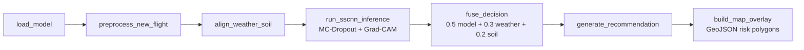

# WDED — Wheat Disease Early Detection

UAV multispectral imagery **fused with lagged weather epidemiology and soil covariates**
for early detection of wheat infection windows — before visible symptoms — across the
**Bishoftu, Asella and Ambo** agricultural research centres, Ethiopia.

Target diseases: **stem rust** (incl. Ug99 watch), **stripe rust**, **leaf rust**,
**Septoria** (STB), **Fusarium** (FHB).

[](https://github.com/DivergenTechnology/wheat-disease-early-detection/actions/workflows/ci.yml)
[](https://divergentechnology.github.io/wheat-disease-early-detection/)
[](LICENSE)

---

## What this repository contains

| Path | Purpose |
|------|---------|
| `wded/` | The 7-stage inference pipeline (see below) |
| `tests/` | Integration tests running the full pipeline on synthetic data |
| `docs/index.html` | **Live risk dashboard** (GitHub Pages) |
| `docs/data/` | Published dashboard artifacts (`latest_risk.geojson`, `latest_attention.geojson`, `summary.json`) |
| `docs/pipeline_design.md` | The agreed inference-pipeline design specification |
| `docs/plan/` | 24-month implementation plan (Word document) |

### The 7-stage inference pipeline



| Stage | Module | Output |
|-------|--------|--------|
| 1. Model loading | `wded/models/` | SSCNN adapter (torch checkpoint or deterministic mock) |
| 2. Flight preprocessing | `wded/preprocess.py` | 32 px tiles + NDVI / NDRE / REIP / GNDVI / GLCM texture |
| 3. Covariate alignment | `wded/alignment.py` | Lagged infection-window weather priors + soil score + LSTM weather sequences |
| 4. Inference | `wded/inference.py` | Per-tile disease probabilities, MC-Dropout uncertainty, attention |
| 5. Fusion & tiering | `wded/fusion.py` | Fused risk, tiers (low → critical), asymmetric-cost escalation |
| 6. Recommendation | `wded/recommendation.py` | Tier-specific, disease-specific agronomic actions |
| 7. Map overlay | `wded/mapping.py` | GeoJSON risk polygons + attention heatmap points |

### Trust layer (baked into the decision engine)

- **MC-Dropout uncertainty** — `mc_passes` stochastic forward passes; mean predictive std per tile.
- **Temperature calibration** — `calibration.json` temperature applied to model probabilities.
- **Open-set rejection** — max disease probability in `[0.35, 0.55)` is the *ambiguous zone*
  (expert review); below 0.35 the model is confidently healthy; at or above 0.55 it makes a
  confident disease call.
- **Asymmetric-cost escalation** — because a missed infection costs ~5× a false alarm, a risk
  sitting within `escalation_margin` (default 0.05) below a tier boundary is handled as the
  higher tier.
- **Expert review queue** — `expert_review_queue.csv` lists every tile flagged by uncertainty
  or open-set checks, sorted by risk.

## Quickstart

```bash
pip install -r requirements.txt

# Full pipeline on synthetic data (no GPU, no torch needed)
python -m wded.cli demo --publish-to docs/data

# Run the test suite
pytest -q
```

The demo generates a synthetic Mavic 3M flight (4 bands, three disease hotspots near
Bishoftu), 60 days of station weather, a soil record, and a mock SSCNN — then runs every
stage and prints the tier distribution.

## Using real flights and the trained model

1. **Flight data** — export the orthomosaic as one GeoTIFF per band into
   `flight/bands/{green,red,red_edge,nir}.tif` (needs `pip install 'wded[geo]'`), or provide a
   `flight/flight.npz` + `flight_meta.json` (affine geotransform, CRS, capture date, site id).
2. **Model checkpoint** — place `model.pt` in the model directory, saved as
   `torch.save({"model": module, "meta": {...}})`. The module must implement
   `forward(spectral (N,B,H,W), weather (N,W,F)) -> logits (N, D)` with the disease order
   `("stem_rust", "stripe_rust", "leaf_rust", "septoria", "fusarium")`.
   Optional: `metadata.json` (e.g. `{"gradcam_layer": "backbone.6"}`) and
   `calibration.json` (`{"temperature": 1.42}`).
3. **Run**:

```bash
wded run \
  --model-dir models/trained \
  --flight-dir flights/2027-07-14_bishoftu \
  --weather weather/bishoftu_station.csv \
  --soil soil/bishoftu.csv \
  --site bishoftu \
  --publish-to docs/data
```

## Risk dashboard (GitHub Pages)

The dashboard is served from `docs/` → <https://divergentechnology.github.io/wheat-disease-early-detection/>

It renders the fused risk polygons, the Grad-CAM attention layer, the expert review queue,
and dominant-disease distribution — all from the committed artifacts in `docs/data/`.
To publish a new run: `python -m wded.cli run ... --publish-to docs/data`, commit, push.

## Decision logic (transparent by design)

```
risk_d   = 0.5 · P(disease d | SSCNN, MC-calibrated)
         + 0.3 · prior_weather(d)          # lagged infection window: temp suitability,
                                           # leaf wetness, rainfall  (wded/alignment.py)
         + 0.2 · soil_score                # pH, drainage, previous cereal  (wded/alignment.py)

tier     = critical ≥ 0.75 · high ≥ 0.50 · moderate ≥ 0.25 · low < 0.25
review   = uncertainty > 0.08  OR  max prob < 0.55 (open-set)
```

All thresholds and weights live in `wded/config.py` and are meant to be recalibrated
against the 2027 ground-truth campaign (see the implementation plan, MS-4).

## Research context

This repository operationalises the inference pipeline of the research proposal
*"Early Detection and Management of Wheat Diseases Using Multispectral Imaging and
Machine Learning"*. Study sites: Bishoftu (Debre Zeit), Asella, and Ambo agricultural
research centres; sensor platforms: DJI Mavic 3M (4-band) and MicaSense RedEdge-P (5-band).

⚠️ **Research prototype** — calibrated risk estimates are decision support and do not
replace on-ground scouting or pathologist confirmation.

## License

MIT — see [LICENSE](LICENSE).
